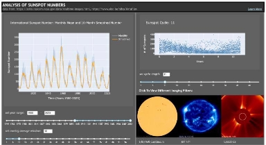

**Sundash:  A Python Dashboard of Time-Series Sunspot Data** 

Kate Lanman 

**Background** 

Sunspots are solar phenomena that look like dark spots on the surface of the sun. Caused by a relatively lower surface temperature, these spots have a positive correlation with solar activity. Thus, analyzing sunspot patterns can have broader applications in understanding space weather and climate change, to name a few examples. 

**Methods and Analysis** 

Data for this analysis were pulled from the Sunspot Index and Long Term Solar Observations (SILSO) website and the Solar and Heliospheric Observatory (SOHO) archives. Specifically, the monthly mean total sunspot number dataset pulled from the SILSO data and the solar images from SOHO were used. Pandas and multiple Plotly libraries (including Dash and Plotly Express) were utilized to create this dashboard.  

**Figure 1.** Monthly Mean Sunspot Number and X-Month Smoothed Number 

The analysis focused on time-series data to look at two things: the monthly mean sunspot number over time and sunspot patterns based on assumed cycle period.  

Figure 1 shows the results of the analysis on monthly mean sunspot number over time. The plot overlays actual monthly mean sunspot numbers and a smoothed line representing the moving average of this metric. By smoothing the data, the user can observe patterns in sunspot numbers with less noise. Through either an input box or a range slider, users can select the range of years they are viewing as well as the number of years the moving average is based on. This functionality was obtained using the dash core components library. 

**Figure 2.** Sunspot Cycle Based on X Year Period 

The figure above shows the created plot of mean monthly sunspots based on a given cycle period (years). This figure allows users to adjust cycle period displayed using  the same methods as outlined above – an input box or a range slider. 

**References **

“Monthly Mean Total Sunspot Number [1/1749-2/2023].” *Sunspot Index and Long- term Solar Observations*. World Data Center for the production, preservation and dissemination of the international sunspot number, 2015, [https://www.sidc.be/silso/INFO/snmtotcsv.p hp.](https://www.sidc.be/silso/INFO/snmtotcsv.php) 

**Figure 3.** SOHO Solar Images 

Figure 3 demonstrates the solar images shown on the dashboard. Each image shown is taken using a different method and should match the most up to date image or gif for that image type posted on the SOHO website. When clicked, each image cycles through two to four different pictures taken using the same method but a different lens. This was possible through tracking n\_clicks and alternating displayed image based on this number.  

The dashboard combines these three features as well as a hyperlink to the Wikipedia site on sunspots. 

“SOHO Real Time GIF Movies.” *Solar and Heliospheric Observatory*, National Aeronautics and Space Administration, [https://soho.nascom.nasa.gov/data/realtime/ gif/.](https://soho.nascom.nasa.gov/data/realtime/gif/) 

“Sunspot.” *Wikipedia*, Wikimedia Foundation, en.wikipedia.org/wiki/Sunspot.  

“The Very Latest SOHO Images.” *Solar and Heliospheric Observatory*, National Aeronautics and Space Administration, https://soho.nascom.nasa.gov/data/realtime- images.html. 

**Conclusion** 

The current version of this dashboard is shown above. Currently, this dashboard is being deployed through Render at [https://sundash.onrender.com/ ](https://sundash.onrender.com/)and the full source code can be found at [https://github.com/katelanman/sunspots.](https://github.com/katelanman/sunspots) 
